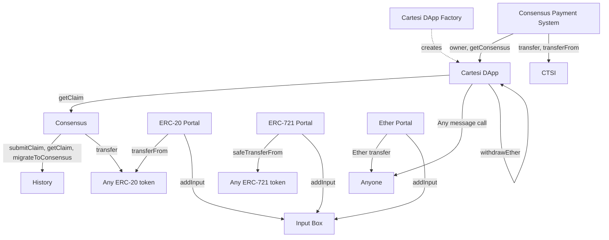

# Cartesi Rollups

This repository contains the on-chain and off-chain pieces that are used to deploy, launch and interact with Cartesi Rollups DApps. The code presented here is work in progress, continuously being improved and updated.

## Table of contents

- [Documentation](#documentation)
- [Experimenting](#experimenting)
- [Talk with us](#talk-with-us)
- [Contributing](#contributing)
- [Setting up](#setting-up)
- [Testing](#testing)
- [License](#license)

## Documentation

Several articles were written about the code presented here:

- [Cartesi Rollups - Scalable Smart Contracts Built with mainstream software stacks](https://medium.com/cartesi/scalable-smart-contracts-on-ethereum-built-with-mainstream-software-stacks-8ad6f8f17997)
- [Rollups On-Chain - Tackling Social Scalability](https://medium.com/cartesi/rollups-on-chain-d749744a9cb3)
- [State Fold](https://medium.com/cartesi/state-fold-cfe5f4d79639)
- [Transaction Manager](https://medium.com/cartesi/cartesi-rollups-rollout-transaction-manager-4a49af15d6b9)

## On-chain Rollups

Designed to mediate the relationship between the off-chain components with other smart contracts and externally owned accounts. It is composed by several modules, each with clear responsibilities and well-defined interfaces. The modules are the following:



## Input Box

This module is the one responsible for receiving inputs from users that want to interact with DApps. For each DApp, the module keeps an append-only list of hashes. Each hash is derived from the input and some metadata, such as the input sender, and the block timestamp. All the data needed to recontstruct a hash is available forever on-chain. As a result, one does not need to trust data providers in order to sync the off-chain machine with the latest input. Note that, because this module is completely permissionless, we leave the off-chain machine to judge whether an input is valid or not.

## Cartesi DApp

A Cartesi DApp contract, just like any other contract on Ethereum, has a unique address. With this address, a DApp can hold ownership over digital assets on Layer-1 like Ether, ERC-20 tokens, and NFTs. In the next sections, we'll explain how DApps are able to receive assets through portals, and perform arbitrary message calls, such as asset transfers, through vouchers.
Since there is no access control to execute a voucher, the caller must also provide a proof that such voucher was generated by the off-chain machine. This proof is checked on-chain against a claim, that is provided by the DApp's consensus. Therefore, a DApp must trust its consensus to only provide valid claims. But, if the consensus goes inactive or rogue, the DApp owner can migrate to a new consensus. In summary, DApp users must trust the DApp owner to choose a trustworthy consensus.

## Cartesi DApp Factory

The Cartesi DApp Factory allows anyone to deploy Cartesi DApp contracts with a simple function call, costing only 3.5% more gas than deploying the DApp contract directly. It also provides greater convenience to the deployer, and security to users and validators, as they know the bytecode could not have been altered maliciously.

## Portals

Portals, as the name suggests, are used to teleport assets from the Ethereum blockchain to DApps running on Cartesi Rollups. Once deposited, those Layer-1 assets gain a representation in Layer-2 and are owned, there, by whomever the depositor assigned them to. After being teleported, Layer-2 assets can be moved around in a significantly cheaper way, using simple inputs that are understood by the Linux logic. When an asset is deposited, the Portal contract sends an input to the DApp’s inbox, describing the type of asset, amount, receivers, and some data the depositor might want the DApp to read. This allows deposits and instructions to be sent as a single Layer-1 interaction.
One could think of the Portal as a bank account, owned by the off-chain machine. Anyone can deposit assets there but only the DApp — through vouchers — can decide on withdrawals. The withdrawal process is quite simple from a user's perspective. They send an input requesting a withdrawal, which gets processed and interpreted off-chain. If everything is correct, the machine creates a voucher destined to the appropriate Portal contract, ordering and finalizing that withdrawal request.
Currently, we support the following types of assets:

- [Ether](https://ethereum.org/en/eth/) (ETH)
- [ERC-20](https://ethereum.org/en/developers/docs/standards/tokens/erc-20/)
- [ERC-721](https://ethereum.org/en/developers/docs/standards/tokens/erc-721/) (NFTs)

## Vouchers

A voucher is a combination of a target address and a payload in bytes. It is used by the off-chain machine to respond and interact with Layer-1 smart contracts. When vouchers get executed they’ll simply send a message to the target address with the payload as a parameter. Therefore, vouchers can be anything ranging from providing liquidity in a DeFi protocol to withdrawing funds from the Portal. Each input can generate a number of vouchers that will be available for execution once the claim containing them is submitted by the consensus.
While the DApp contract is also indifferent to the content of the voucher being executed, it enforces some sanity checks before allowing its execution: each voucher can only be successfully executed once. Vouchers are executed asynchronously and don’t require an access check. The order of execution is not enforced — as long as the vouchers are contained in a claim and were not executed before, the contract will allow their execution by anyone. The DApp ensures, however, that only vouchers suggested by the off-chain machine and claimed on-chain can be executed. It does so by requiring a validity proof to be sent with the voucher execution call.

## Notices

Notices are informational statements that can be proved on L1 by other smart contracts. They're emitted by the off-chain machine and contain a payload, in bytes. DApp developers are free to explore different use cases for notices, their generality and negligible cost of emission makes them a powerful tool to assist integration between L2 DApps and L1 smart contracts or even other L2 DApps. Similarly to vouchers, notices can only be proved once they've been finalized on-chain and if they're accompanied by a validity proof. A chess DApp could, for example, emit a notice informing the underlying blockchain of the winner of a tournament - while that information is not necessarily "actionable", it could be used by other applications for different purposes.

## Consensus

This module is responsible for providing valid claims to DApps after reaching some form of consensus. The module's interface aims to be as generic as possible to accomodate any consensus model, since there are plenty to choose from. The way how claims are encoded and stored is abstracted entirely by the consensus, and is left to the History contract.
The only type of consensus that is currently implemented by Cartesi is called Authority. It is owned by a single address, who has complete power over the consensus. It is arguably the simplest consensus to implement, although quite vulnerable.

## History

The sole purpose of this module is to store claims and to allow them to be retrieved later. Just as with the consensus interface, we leave much of the details open for each implementation to define.
Our only implementation of history stores claims in a very simple manner: each claim is composed of an epoch hash and a range of input indices. Each DApp has its own append-only list of claims, where ranges don't overlap and input indices can only grow. As a result, one cannot overwrite past claims or claim in a non-linear order.

## Consensus Payment System

This module is responsible for managing the funding of DApps and payment of consensuses, and uses CTSI as currency. In order for a DApp to participate in the system, its owner must first register it. Once registered, a DApp will have its own internal account where anyone will be able to deposit their tokens. Meanwhile, consensuses don't need any form of registration in order to partake in the system: each will already have their own internal account where DApps can deposit their payments. Beware that a DApp's owner can withdraw tokens from their DApp's funds account at any time.
Consensuses can also withdraw tokens from their accounts. In fact, anyone can do this operation on their behalf, which is great for modularity, as we don't force consensuses to have an entry point for withdrawing their payment. DApps pay their consensuses a fixed amount of tokens every second. This amount, called "salary", is set by the DApp's owner upon registration, and can be later updated. The system is able to calculate the exact amount of tokens that a DApp owes its consensus by keeping a "clock" that tells the last time both parties were "even" in terms of payment. If, at some point, the DApp does not have enough funds to pay its consensus for the whole duration of their work, then the consensus will only be paid partially, limited by the DApp's funds. And, in these cases, the DApp's clock will be advanced proportionally.

As for migrations, the system handles it in the following way. Since it cannot know when exactly a migration happened, it can't be always fair in terms of payment to both the old and the new consensuses. As not to be unfair to the old consensus, the DApp pays them for the entire duration between its clock and the time of payment. To implement this policy, the system has to store the last known consensus of each DApp. The accounting state of a DApp advances through so-called "updates", which can be triggered by anyone. It involves transferring the owed payment (or a fraction of it) from the DApp's funds account into the consensus' payment account, advancing the DApp's clock by the paid time period, and updating the DApp's consensus.

## Dispute Resolution

Disputes occur when two validators claim different state updates to the same epoch. Because of the deterministic nature of our virtual machine and the fact that the inputs that constitute an epoch are agreed upon beforehand, conflicting claims imply dishonest behavior. When a conflict occurs, the module that mediates the interactions between both validators is the dispute resolution.
The code for rollups dispute resolution is not being published yet - but a big part of it is available on the Cartesi Rollups SDK, using the [Arbitration dlib](https://github.com/cartesi/arbitration-dlib/)

## Off-chain Rollups

The Rollups machine and the smart contracts live in fundamentally different environments. This creates the need for a middleware that manages and controls the communication between the blockchain and the machine.
As such, the middleware is responsible for first reading data from our smart contracts, then sending them to the machine to be processed, and finally publishing their results back to the blockchain.
The middleware can be used by anyone who's interested in the rollups state of affairs. We divide interested users into two roles, which run different types of nodes: readers and validators. Reader nodes are only interested in advancing their off-chain machine. They consume information from the blockchain but do not bother to enforce state updates, trusting that validators will ensure the validity of all on-chain state updates. Validators, on the other hand, have more responsibility: they not only watch the blockchain but also fight to ensure that the blockchain will only accept valid state updates.

## Experimenting

To get a taste on how to use Cartesi to develop your DApp, check the following resources:
See Cartesi Rollups in action with the Simple Echo Examples in [C++](https://github.com/cartesi/rollups-examples/tree/main/echo-cpp), [JavaScript](https://github.com/cartesi/rollups-examples/tree/main/echo-js), [Lua](https://github.com/cartesi/rollups-examples/tree/main/echo-lua), [Rust](https://github.com/cartesi/rollups-examples/tree/main/echo-rust) and [Python](https://github.com/cartesi/rollups-examples/tree/main/echo-python).
To have a glimpse on how to develop your DApp locally using your favorite IDE and tools check our Host Environment in the [Rollups Examples](https://github.com/cartesi/rollups-examples) repository.

## Talk with us

If you’re interested in developing with Cartesi, working with the team, or hanging out in our community, don’t forget to [join us on Discord and follow along](https://discordapp.com/invite/Pt2NrnS).

Want to stay up to date? Make sure to join our [announcements channel on Telegram](https://t.me/CartesiAnnouncements) or [follow our Twitter](https://twitter.com/cartesiproject).

## Contributing

Thank you for your interest in Cartesi! Head over to our [Contributing Guidelines](CONTRIBUTING.md) for instructions on how to sign our Contributors Agreement and get started with Cartesi!

Please note we have a [Code of Conduct](CODE_OF_CONDUCT.md), please follow it in all your interactions with the project.

## Setting up

### Initialize submodules recursively

In order to also clone submodules like `grpc-interfaces` and `state-fold`, you need to run the following command.

```sh
git submodule update --init --recursive
```

### Compile on-chain code

The on-chain part is mainly written in Solidity and Typescript. For that, you'll need `yarn` to install dependencies and to run build scripts.

```sh
cd onchain
yarn
cd rollups
yarn build
```

### Compile off-chain code

The off-chain code is written in Rust. For that, you'll need `cargo`. See the [Rust documentation](https://doc.rust-lang.org/cargo/getting-started/installation.html) for instructions on how to install `cargo` on your system.

```sh
cd offchain
cargo build
```

## Testing

Once you've setup the repository, you can test the different pieces that compose Cartesi Rollups individually.

### Testing the on-chain code

```sh
cd onchain/rollups
yarn test
```

### Testing the state-server

Make sure you built the offchain code:

```sh
cd offchain
cargo build
```

Now you can run the onchain tests alongside the state servers by running the following commands:

```sh
cd onchain/rollups
STATE_FOLD_TEST=true yarn test
```

## License

Note: This component currently has dependencies that are licensed under the GNU GPL, version 3, and so you should treat this component as a whole as being under the GPL version 3. But all Cartesi-written code in this component is licensed under the Apache License, version 2, or a compatible permissive license, and can be used independently under the Apache v2 license. After this component is rewritten, the entire component will be released under the Apache v2 license.
The arbitration d-lib repository and all contributions are licensed under
[GPL 3](https://www.gnu.org/licenses/gpl-3.0.en.html). Please review our [COPYING](COPYING) file.
