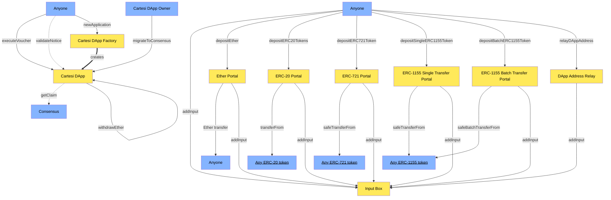

# Cartesi Rollups

This repository contains the on-chain and off-chain pieces that are used to deploy, launch and interact with Cartesi Rollups DApps. The code presented here is work in progress, continuously being improved and updated.

## Table of contents

- [Documentation](#documentation)
- [Experimenting](#experimenting)
- [Talk with us](#talk-with-us)
- [Contributing](#contributing)
- [Setting up](#setting-up)
- [Testing](#testing)
- [License](#license)

## Documentation

Check the [official Cartesi Rollups documentation website](https://docs.cartesi.io/cartesi-rollups/overview/).

## On-chain Rollups

Designed to mediate the relationship between the off-chain components with other smart contracts and externally owned accounts. It is composed by several modules, each with clear responsibilities and well-defined interfaces. The modules are depicted in the diagram below. The yellow boxes correspond to the core contracts, and the blue boxes correspond to externally-owned accounts (EOAs) or other contracts.



## Input Box

This module is the one responsible for receiving inputs from users that want to interact with DApps. For each DApp, the module keeps an append-only list of hashes. Each hash is derived from the input and some metadata, such as the input sender, and the block timestamp. All the data needed to recontstruct a hash is available forever on-chain. As a result, one does not need to trust data providers in order to sync the off-chain machine with the latest input. Note that this module is completely permissionless, and we leave the off-chain machine to judge whether an input is valid or not.

## Cartesi DApp

A Cartesi DApp contract, just like any other contract on Ethereum, has a unique address. With this address, a DApp can hold ownership over digital assets on the base layer like Ether, ERC-20 tokens, and NFTs. In the next sections, we'll explain how DApps are able to receive assets through portals, and perform arbitrary message calls, such as asset transfers, through vouchers.

Since there is no access control to execute a voucher, the caller must also provide a proof that such voucher was generated by the off-chain machine. This proof is checked on-chain against a claim, that is provided by the DApp's consensus. Therefore, a DApp must trust its consensus to only provide valid claims. However, if the consensus goes inactive or rogue, the DApp owner can migrate to a new consensus. In summary, DApp users must trust the DApp owner to choose a trustworthy consensus.

## Cartesi DApp Factory

The Cartesi DApp Factory allows anyone to deploy Cartesi DApp contracts with a simple function call, costing only 3.5% more gas than deploying the DApp contract directly. It also provides greater convenience to the deployer, and security to users and validators, as they know the bytecode could not have been altered maliciously.

## Portals

Portals, as the name suggests, are used to safely teleport assets from the base layer to the execution layer. It works in the following way. First, for some types of assets, the user has to allow the portal to deduct the asset(s) from their account. Second, the user tells the portal to transfer the asset(s) from their account to some DApp's account. If the transfer is successful, the portal adds an input to the DApp's input box to inform the machine about the transfer that just took place in the base layer. Finally, the off-chain machine is made aware of the transfer through the input sent by the portal. Note that the machine must know the address of the portal beforehand in order to validate such input.

The DApp developer can choose to do whatever they want with this information. For example, they might choose to create a wallet for each user in the execution layer, where assets can be managed at a much lower cost through inputs that are understood by the Linux logic. In this sense, one could think of the DApp contract as a wallet, owned by the off-chain machine. Anyone can deposit assets there but only the DApp—through vouchers—can decide on withdrawals.

The withdrawal process is quite simple from the user's perspective. Typically, the user would first send an input to the DApp requesting the withdrawal, which would then get processed and interpreted off-chain. If all goes well, the machine should generate a voucher that, once executed, transfers the asset(s) to the rightful recipient.

Currently, we support the following types of assets:

- [Ether](https://ethereum.org/en/eth/) (ETH)
- [ERC-20](https://ethereum.org/en/developers/docs/standards/tokens/erc-20/) (Fungible tokens)
- [ERC-721](https://ethereum.org/en/developers/docs/standards/tokens/erc-721/) (Non-fungible tokens)
- [ERC-1155](https://ethereum.org/en/developers/docs/standards/tokens/erc-1155/) (Multi-tokens)

### Input encodings for deposits

As explained above, in order to teleport assets to the execution layer, the portals add inputs to the DApp's input box, which will then need to be interpreted and validated by the off-chain machine. To do that, the machine will need to understand and decode each input's payload.

The input payloads for deposits are always specified as packed ABI-encoded parameters, as detailed below:

| Asset | Payload |
| :- | :- |
| Ether | `address sender, uint256 value, bytes execLayerData` |
| ERC-20 | `bool success, address token, address sender, uint256 amount, bytes execLayerData` |
| ERC-721 | `address token, address sender, uint256 tokenId, bytes data` `*` |
| ERC-1155 (single) | `address token, address sender, uint256 tokenId, uint256 value, bytes data` `*`|
| ERC-1155 (batch) | `address token, address sender, bytes data` `**` |

**`*`** The ERC-721 and ERC-1155 (single) `data` fields correspond to the standard (unpacked) ABI-encoding of: `bytes baseLayerData, bytes execLayerData`

**`**`** The ERC-1155 (batch) `data` field corresponds to the standard (unpacked) ABI-encoding of: `uint256[] tokenIds, uint256[] values, bytes baseLayerData, bytes execLayerData`

As an example, the deposit of 100 Wei (of Ether) sent by address `0xf39fd6e51aad88f6f4ce6ab8827279cfffb92266` with data `0xabcd` would result in the following input payload:

```
0xf39fd6e51aad88f6f4ce6ab8827279cfffb922660000000000000000000000000000000000000000000000000000000000000064abcd
```

## Vouchers

Vouchers allow DApps in the execution layer to interact with contracts in the base layer through message calls. They are emitted by the off-chain machine, and executed by anyone in the base layer. Each voucher is composed of a destination address and a payload. In Solidity terms, the payload encodes the function signature and the arguments.

A voucher can only be executed once the DApp's consensus submits a claim containing it. They can be executed in any order. Although the DApp contract is indifferent to the content of the voucher being executed, it enforces some sanity checks before allowing its execution. First, it checks whether the voucher has been successfully executed already. Second, it ensures that the voucher has been emitted by the off-chain machine, by requiring a validity proof.

Because of their generality, vouchers can be used in a wide range of applications: from withdrawing funds to providing liquidity in a DeFi protocol. Typically, DApps use vouchers to withdraw assets. Below, we show how vouchers can be used to withdraw different types of assets. You can find more information about a particular function by clicking on the :page_facing_up: emoji near it.

| Asset | Destination | Function |
| :- | :- |  :- |
| Ether | DApp contract | `withdrawEther(address,uint256)` [:page_facing_up:](https://github.com/cartesi/rollups/tree/main/onchain/rollups/contracts/dapp/CartesiDApp.sol) |
| ERC-20 | Token contract | `transfer(address,uint256)` [:page_facing_up:](https://eips.ethereum.org/EIPS/eip-20#methods) |
| ERC-20 | Token contract | `transferFrom(address,address,uint256)` [:page_facing_up:](https://eips.ethereum.org/EIPS/eip-20#methods) [^1] |
| ERC-721 | Token contract | `safeTransferFrom(address,address,uint256)` [:page_facing_up:](https://eips.ethereum.org/EIPS/eip-721#specification) |
| ERC-721 | Token contract | `safeTransferFrom(address,address,uint256,bytes)` [:page_facing_up:](https://eips.ethereum.org/EIPS/eip-721#specification) [^2] |
| ERC-1155 | Token contract | `safeTransferFrom(address,address,uint256,uint256,data)` [:page_facing_up:](https://eips.ethereum.org/EIPS/eip-1155#specification) |
| ERC-1155 | Token contract | `safeBatchTransferFrom(address,address,uint256[],uint256[],data)` [:page_facing_up:](https://eips.ethereum.org/EIPS/eip-1155#specification) [^3] |

Please note that the voucher payload should be encoded according to the [Ethereum ABI specification for calling contract functions](https://docs.soliditylang.org/en/v0.8.19/abi-spec.html). As such, it should start with the first four bytes of the Keccak-256 hash of the function signature string (as given in the table above), followed by the ABI-encoded parameter values.

As an example, the voucher for a simple ERC-20 transfer (2nd line in the table above) to address `0xf39fd6e51aad88f6f4ce6ab8827279cfffb92266` with amount 100 should specify the following payload:

```
0xa9059cbb000000000000000000000000f39fd6e51aad88f6f4ce6ab8827279cfffb922660000000000000000000000000000000000000000000000000000000000000064
```

[^1]: If the DApp owns the tokens, prefer to use `transfer(address,uint256)`
[^2]: If no data is being passed as argument, prefer to use `safeTransferFrom(address,address,uint256)`
[^3]: If only one token is being transferred, prefer to use `safeTransferFrom(address,address,uint256,uint256,data)`

## DApp Address Relay

In the previous section, we showed how vouchers can be used to withdraw different types of assets. Most of those vouchers contained the address of the DApp contract, which depends on the initial state of the machine. This "chicken-and-egg" problem is circumvented by a very small permissionless contract in the base layer, the DApp Address Relay ([source](https://github.com/cartesi/rollups/tree/main/onchain/rollups/contracts/relays/DAppAddressRelay.sol)). Its only job is to add an input to a DApp's input box with the DApp contract address. The off-chain machine then decodes this input and stores the address somewhere for future use. Just like in the case of portals, the machine must also know the address of the relay in order to validate the origin of the input.

## Notices

Notices are informational statements that can be proved by contracts in the base layer. They're emitted by the off-chain machine and contain a payload, in bytes. DApp developers are free to explore different use cases for notices, their generality and negligible cost of emission makes them a powerful tool to assist integration between DApps and contracts or even other DApps. Similar to vouchers, notices can only be proved once they've been finalized on-chain and if they're accompanied by a validity proof. A chess DApp could, for example, emit a notice informing the underlying blockchain of the winner of a tournament. While that information is not necessarily "actionable", it could be used by other applications for different purposes.

## Consensus

This module is responsible for providing valid claims to DApps after reaching some form of consensus. The module's interface aims to be as generic as possible to accomodate any consensus model, since there are plenty to choose from. The way claims are encoded and stored is abstracted entirely by the interface. Implementation-wise, this is left to a History contract.

The only type of consensus that is currently implemented by Cartesi is called Authority. It is owned by a single address, who has complete power over the consensus. It is arguably the simplest consensus to implement, although quite vulnerable.

## History

The sole purpose of this module is to store claims and to allow them to be retrieved later. Just as with the consensus interface, we leave much of the details open for the implementation to define.

Our only implementation of history stores claims in a very simple manner: each claim is composed of an epoch hash and a range of input indices. Each DApp has its own append-only list of claims, where ranges don't overlap, and come one after the other. As a result, one cannot overwrite past claims or claim in a non-linear order.

## Dispute Resolution

Disputes occur when two validators claim different state updates to the same epoch. Because of the deterministic nature of our virtual machine and the fact that the inputs that constitute an epoch are agreed upon beforehand, conflicting claims imply dishonest behavior. When a conflict occurs, the module that mediates the interactions between both validators is the dispute resolution.

The code for rollups dispute resolution is not being published yet, but a big part of it is available on the Cartesi Rollups SDK, using the [Arbitration dlib](https://github.com/cartesi/arbitration-dlib/)

## Off-chain Rollups

The Rollups machine and the smart contracts live in fundamentally different environments. This creates the need for a middleware that manages and controls the communication between the blockchain and the machine.
As such, the middleware is responsible for first reading data from our smart contracts, then sending them to the machine to be processed, and finally publishing their results back to the blockchain.
The middleware can be used by anyone who's interested in the rollups state of affairs. We divide interested users into two roles, which run different types of nodes: readers and validators. Reader nodes are only interested in advancing their off-chain machine. They consume information from the blockchain but do not bother to enforce state updates, trusting that validators will ensure the validity of all on-chain state updates. Validators, on the other hand, have more responsibility: they not only watch the blockchain but also fight to ensure that the blockchain will only accept valid state updates.

## Experimenting

To get a taste on how to use Cartesi to develop your DApp, check the following resources:
See Cartesi Rollups in action with the Simple Echo Examples in [C++](https://github.com/cartesi/rollups-examples/tree/main/echo-cpp), [JavaScript](https://github.com/cartesi/rollups-examples/tree/main/echo-js), [Lua](https://github.com/cartesi/rollups-examples/tree/main/echo-lua), [Rust](https://github.com/cartesi/rollups-examples/tree/main/echo-rust) and [Python](https://github.com/cartesi/rollups-examples/tree/main/echo-python).
To have a glimpse on how to develop your DApp locally using your favorite IDE and tools check our Host Environment in the [Rollups Examples](https://github.com/cartesi/rollups-examples) repository.

## Talk with us

If you're interested in developing with Cartesi, working with the team, or hanging out in our community, don't forget to [join us on Discord and follow along](https://discordapp.com/invite/Pt2NrnS).

Want to stay up to date? Make sure to join our [announcements channel on Telegram](https://t.me/CartesiAnnouncements) or [follow our Twitter](https://twitter.com/cartesiproject).

## Contributing

Thank you for your interest in Cartesi! Head over to our [Contributing Guidelines](CONTRIBUTING.md) for instructions on how to sign our Contributors Agreement and get started with Cartesi!

Please note we have a [Code of Conduct](CODE_OF_CONDUCT.md), please follow it in all your interactions with the project.

## Setting up

### Initialize submodules recursively

In order to also clone submodules like `grpc-interfaces` and `state-fold`, you need to run the following command.

```sh
git submodule update --init --recursive
```

### Building Docker images

To build the Rollups Docker images, run the following command.

```
docker buildx bake --load
```

### Compile on-chain code

The on-chain part is mainly written in Solidity and Typescript. For that, you'll need `yarn` to install dependencies and to run build scripts.

```sh
cd onchain
yarn
cd rollups
yarn build
```

### Compile off-chain code

The off-chain code is written in Rust. For that, you'll need `cargo`. See the [Rust documentation](https://doc.rust-lang.org/cargo/getting-started/installation.html) for instructions on how to install `cargo` on your system.

```sh
cd offchain
cargo build
```

## Testing

Once you've setup the repository, you can test the different pieces that compose Cartesi Rollups individually.

### Testing the on-chain code

Since we have test cases for voucher execution and notice validation, we need to generate Merkle proofs for those voucher/notice test cases. Please first visit [this README](https://github.com/cartesi/rollups/tree/main/onchain/rollups/test/foundry/dapp/helper) for instructions on how to set up and update Merkle proofs. Afterwards, run the following commands for on-chain tests.

```sh
cd onchain/rollups
yarn test
```

### Testing the state-server

Make sure you built the offchain code:

```sh
cd offchain
cargo build
```

Now you can run the on-chain tests alongside the state servers by running the following commands:

```sh
cd onchain/rollups
STATE_FOLD_TEST=true yarn test
```

## License

Note: This component currently has dependencies that are licensed under the GNU GPL, version 3, and so you should treat this component as a whole as being under the GPL version 3. But all Cartesi-written code in this component is licensed under the Apache License, version 2, or a compatible permissive license, and can be used independently under the Apache v2 license. After this component is rewritten, the entire component will be released under the Apache v2 license.
The arbitration d-lib repository and all contributions are licensed under
[GPL 3](https://www.gnu.org/licenses/gpl-3.0.en.html). Please review our [COPYING](COPYING) file.
