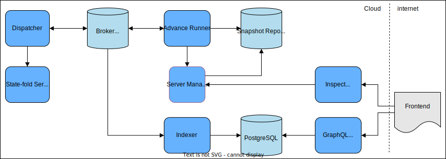
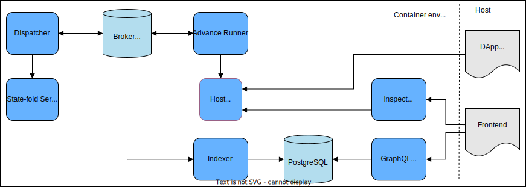

# Cartesi Node Reference Implementation

The [Cartesi Node](https://docs.cartesi.io/cartesi-rollups/main-concepts/#cartesi-nodes) is the part of the Cartesi Rollups Framework responsible for handling the communication between the on-chain smart contracts an the [Cartesi Machine](https://docs.cartesi.io/machine/intro/).

## Getting Started

All projects comprising the Cartesi Node require Rust to be executed.
To install it, follow the [instructions](https://www.rust-lang.org/tools/install) from the Rust website.

### Dependencies

Before building and running any of the inner projects, you should download the submodules with:

```shell
git submodule update --init --recursive
```

The Cartesi Node depends on the following components:

| Component | Version |
|---|---|
| Cartesi Machine SDK | [v0.16.2](https://github.com/cartesi/machine-emulator/releases/tag/v0.16.2) |
| Cartesi OpenAPI Interfaces | [v0.6.0](https://github.com/cartesi/openapi-interfaces/releases/tag/v0.6.0) |
| Cartesi Server Manager | [v0.8.2](https://github.com/cartesi/server-manager/releases/tag/v0.8.2) |

### Running

To run any of the inner projects, execute the command:

```shell
cargo run
```

Some of the inner projects may have additional run instructions.
Refer to their own documentation for more details.

#### Configuration

It is possible to configure the behavior of any of the projects by passing CLI arguments and using environment variables.
Execute the following command to check the available options for each project:

```shell
cargo run -- -h
```

##### Redis TLS Configuration

To connect the Broker to a Redis server via TLS, the server's URL must use the `rediss://` scheme (with two "s"es).
This is currently the only way to tell `Broker` to use a TLS connection.

### Tests

To run the tests available in any of the projects, execute the command:

```shell
cargo test
```

## Architecture Overview

The Cartesi Node is an event-based solution that may be depicted as follows:



The **Broker** is a Redis-based message broker that mediates the transferring of *Inputs*, *Outputs* and *Claims* between the Cartesi Node components.
For details specific to the Broker and the available event streams, refer to the [Rollups Events project](./rollups-events/README.md).

The [**State-fold Server**](./state-server/README.md) is the component responsible for tracking blockchain state changes and deriving *Inputs* from them to be processed.

The [**Dispatcher**](./dispatcher/README.md) is the component that messages *Inputs* via the **Broker** to be processed elsewhere and submits *Claims* to the blockchain.

The [**Advance Runner**](./advance-runner/README.md) is the one responsible for relaying *Inputs* to the **Server Manager** to be processed by the underlying DApp running in the embedded **Cartesi Machine**.
The **Advance Runner** obtains the resulting **Outputs** and **Claims** from the **Server Manager** and adds them to the **Broker**.

The [**Indexer**](./indexer/README.md) consumes all *Inputs* and *Outputs* transferred by the **Broker** and store them in a **PostgreSQL** database for later querying via a **GraphQL Server** instance.

The [**Inspect Server**](./inspect-server/README.md) is responsible for the processing of *Inspect* requests via HTTP.

## Workflows

The Cartesi Node may act as a *User* (aka *Reader*) or *Validator* Node, hence performing different roles, which may be represented by different workflows.

### Reader Flow

In the Reader Flow, any *Input* read from the blockchain by the **State-fold Server** is received by the **Dispatcher** and relayed to the **Broker** through an input-specific stream.
The *Input* is eventually consumed by the **Advance Runner** and used to advance the state of the **Server Manager**, thus generating an *Advance* request to be processed by the underlying DApp.

After finishing the processing, the DApp may generate a number of *Outputs*, which are eventually retrieved by the **Advance Runner** and fed back into the **Broker** through an output-specific stream.

*Inputs* and *Outputs* are consumed from their respective streams by the **Indexer** and stored in a **PostgreSQL** database and may be queried by the DApp **Frontend** via a **GraphQL Server** instance.

### Validator Flow

The Validator Flow may only be performed by *Validator* nodes.
It complements the Reader Flow by generating *Claims* at the end of *Epochs*, which are generated by the **Server Manager**, and sent to the **Broker** by the **Advance Runner** through a claims-specific stream to be eventually consumed by the **Dispatcher** for being submitted to the blockchain.

### Inspect Data Flow

Every *Inspect* request sent by the **Frontend** via the Rollups HTTP API is captured by the **Inspect Server** and forwarded to the **Server Manager**, which queries the state of the underlying DApp via *Inspect* requests.

Every request results in an *Inspect Response* that is returned to the **Inspect Server**, which sends it back to the **Frontend**.

## Host mode

The Cartesi Node may operate in a so-called *Host mode* when deployed locally for development purposes.

In this case, the overall topology is very similar to the one presented in the [Architecture Overview](#architecture-overview) as depicted below.



The main difference is that the **Server Manager** is not present and, there's no **Cartesi Machine** available as a result.
Their features are emulated by the **Host Runner**, which interacts with the **DApp Backend** being executed locally in the *host* to perform the Cartesi Node [workflows](#workflows).
