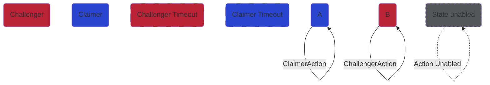
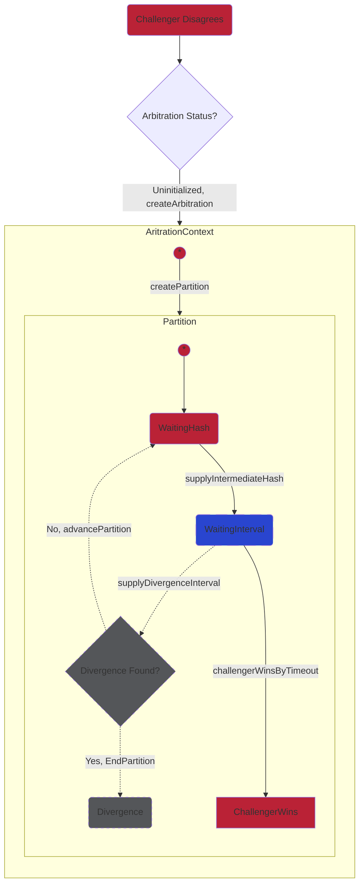
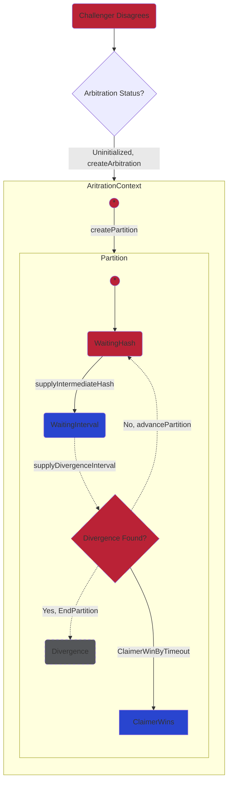

# rollups-arbitration
Rollups Arbitration


# Cartesi Arbitration Game 

This repository contains the on-chain protocol to resolve disputes that might occur during the execution of a Cartesi Dapp.


## Table of contents

- [Previous scenario of arbitration](#previous-scenario-of-arbitration)
- [The arbitration cases](#the-arbitration-cases)
- [Testing](#testing)
- [License](#license)

## Previous scenario of arbitration (or why we need arbitration)

Users are indirectly adding inputs to an input box. These inputs must have data availability as we want to make things disputable.

When there's a claim from a validator an another party disagrees there's a dispute, in this case the arbitration-rollups contract will instantiate an arbitration passing the address of the correct input box.

Validators claim and challenge, right now altruistically but in a future they'll have incentives.

The challenger as is running it's own cartesi machine, it process all the inputs and can challenge if disagrees.
## The arbitration cases

1. Challenger disagrees and wins the arbitration.
2. Challenger disagrees and wins by timeout.
3. Challenger disagrees but claimer wins by timeout.
4. Challenger disagrees but claimer wins.

### Graph legend

### Arbitration case 1
```mermaid
flowchart TB
    A(Challenger Disagrees):::Challenger --> O{Arbitration Status?}
   
    O{Arbitration Status?} -- Uninitialized, createArbitration --> AritrationContext
    O{Arbitration Status?} -. Ongoing .-> AritrationContext
    O{Arbitration Status?} -. Won .-> ChallengerWins
    AritrationContext --> ChallengerWins

    
    subgraph AritrationContext
        direction TB
        P1((*)):::Challenger--createPartition--> Partition
        Partition --stateAdvanceEndPartition--> EpochHash
    end

    subgraph EpochHash
        direction TB
        P3((*)):::Challenger --createSplit--> G(WaitingSubhashes):::Challenger
        G(WaitingSubhashes) --supplySubhashes--> H(WaitingDivergence):::Claimer
        H(WaitingDivergence) --splitMachineDisagree--> MachineSplice
        H(WaitingDivergence) --challengerWinsOutputsSplice--> OutputSplice
    end

    subgraph Partition
        direction TB
        P2((*)):::Challenger --> D(WaitingHash):::Challenger
        D(WaitingHash) --supplyIntermediateHash-->E(WaitingInterval):::Claimer
        E(WaitingInterval) --supplyDivergenceInterval--> B{Divergence Found}
        B{Divergence Found?} --No, advancePartition--> D(WaitingHash)
        B{Divergence Found?} --Yes, EndPartition--> F(Divergence):::Challenger
    end

    subgraph MachineSplice
        direction TB
        P4((*)):::Challenger --createSplice--> I(WaitingSpliceClaim)
        I(WaitingSpliceClaim):::Challenger --spliceSupplyHash--> J(WaitingAgreement)
        J(WaitingAgreement):::Claimer --SpliceAcceptClaim--> N(SpliceAgree):::Challenger
        J(WaitingAgreement) --SpliceRejectClaim--> K(SpliceDisagree):::Challenger
    end

    subgraph OutputSplice
        direction TB
        L(SpliceOutputsProofs):::Challenger -- isvalidOutput --> M(replaceOutputLeaf):::Challenger
    end

    classDef Challenger fill:#ba2236, 
    classDef ChallengerTimeoutOk fill:#ba2236, stroke-dasharray:20
    classDef ChallengerTimeoutPassed fill:#ba2236, stroke-dasharray:20

    classDef Claimer fill:#2945cf

    linkStyle 0 stroke:#e80927 %%% challenger
    linkStyle 1 stroke:#e80927 %%% challenger
    linkStyle 2 stroke:#e80927 %%% challenger
    linkStyle 3 stroke:#e80927 %%% challenger
    linkStyle 4 stroke:#e80927 %%% challenger
    linkStyle 5 stroke:#e80927 %%% challenger
    linkStyle 6 stroke:#e80927 %%% challenger
    linkStyle 7 stroke:#e80927 %%% challenger
    linkStyle 9 stroke:#e80927 %%% challenger
    linkStyle 10 stroke:#e80927 %%% challenger
    linkStyle 11 stroke:#e80927 %%% challenger
    linkStyle 13 stroke:#e80927 %%% challenger
    linkStyle 14 stroke:#e80927 %%% challenger
    linkStyle 15 stroke:#e80927 %%% challenger
    linkStyle 16 stroke:#e80927 %%% challenger
    linkStyle 18 stroke:#e80927 %%% challenger
    linkStyle 19 stroke:#e80927 %%% challenger
    linkStyle 20 stroke:#e80927 %%% challenger

    linkStyle 12 stroke:#1809e8 %%% claimer
    linkStyle 8 stroke:#1809e8 %%% claimer
    linkStyle 17 stroke:#1809e8 %%% claimer
```
### Arbitration case 2



### Arbitration case 3



### Arbitration case 4
    
```mermaid
flowchart TB
A(Challenger Disagrees):::Challenger --> O{Arbitration Status?}
   
    O{Arbitration Status?} -- Uninitialized, createArbitration --> AritrationContext
    O{Arbitration Status?} -. Ongoing .-> AritrationContext
    O{Arbitration Status?} -. Lost .-> ClaimerWins:::Claimer
    AritrationContext --> ClaimerWins

    
    subgraph AritrationContext
        direction TB
        P1((*)):::Challenger--createPartition--> Partition
        Partition --stateAdvanceEndPartition--> EpochHash
    end

    subgraph EpochHash
        direction TB
        P3((*)):::Challenger --createSplit--> G(WaitingSubhashes):::Challenger
        G(WaitingSubhashes) --supplySubhashes--> H(WaitingDivergence):::Claimer
        H(WaitingDivergence) --splitMachineDisagree--> MachineSplice
        H(WaitingDivergence) -.challengerWinsOutputsSplice.-> OutputSplice
    end

    subgraph Partition
        direction TB
        P2((*)):::Challenger --> D(WaitingHash):::Challenger
        D(WaitingHash) --supplyIntermediateHash-->E(WaitingInterval):::Claimer
        E(WaitingInterval) --supplyDivergenceInterval--> B{Divergence Found}
        B{Divergence Found?} --No, advancePartition--> D(WaitingHash)
        B{Divergence Found?} --Yes, EndPartition--> F(Divergence):::Challenger
    end

    subgraph MachineSplice
        direction TB
        P4((*)):::Challenger --createSplice--> I(WaitingSpliceClaim)
        I(WaitingSpliceClaim):::Challenger --spliceSupplyHash--> J(WaitingAgreement)
        J(WaitingAgreement):::Claimer --SpliceAcceptClaim--> N(SpliceAgree):::Challenger
        J(WaitingAgreement) -.SpliceRejectClaim.-> K(SpliceDisagree):::Unabled
    end

    subgraph OutputSplice
        direction TB
        L(SpliceOutputsProofs):::Unabled -. isvalidOutput .-> M(replaceOutputLeaf):::Unabled
    end

    classDef Challenger fill:#ba2236, 
    classDef ChallengerTimeoutOk fill:#ba2236, stroke-dasharray:20
    classDef ChallengerTimeoutPassed fill:#ba2236, stroke-dasharray:20
    classDef Unabled fill:#545659, stroke-dasharray:5 5

    classDef Claimer fill:#2945cf

    linkStyle 0 stroke:#e80927 %%% challenger
    linkStyle 1 stroke:#e80927 %%% challenger
    linkStyle 2 stroke:#e80927 %%% challenger
    linkStyle 3 stroke:#e80927 %%% challenger
    linkStyle 5 stroke:#e80927 %%% challenger
    linkStyle 6 stroke:#e80927 %%% challenger
    linkStyle 7 stroke:#e80927 %%% challenger
    linkStyle 9 stroke:#e80927 %%% challenger
    linkStyle 11 stroke:#e80927 %%% challenger
    linkStyle 13 stroke:#e80927 %%% challenger
    linkStyle 14 stroke:#e80927 %%% challenger
    linkStyle 15 stroke:#e80927 %%% challenger
    linkStyle 16 stroke:#e80927 %%% challenger
    linkStyle 18 stroke:#e80927 %%% challenger

    linkStyle 4 stroke:#1809e8 %%% claimer
    linkStyle 12 stroke:#1809e8 %%% claimer
    linkStyle 8 stroke:#1809e8 %%% claimer
    linkStyle 17 stroke:#1809e8 %%% claimer
```
## Testing
### Software used

We use foundry to test the contracts.

### How to run testing

In order to execute and test the contracts follow the next steps:

1. Clone the repo
2. (Optional) Generate again all the enums. Go to code-generation-scripts and follow the README.
3. Install dependencies by running:
- `forge install git@github.com:foundry-rs/forge-std.git`
- `forge install git@github.com:cartesi/solidity-util.git`
or if it's already installed run:
- `forge update` .
4. Run `forge test` .

