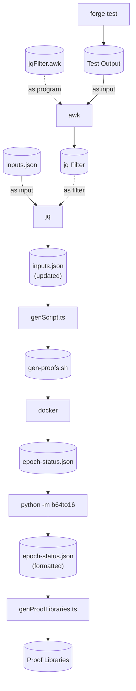

# Updating Proofs

When someone tries to execute a voucher or to validate a notice, they need to provide a proof. This proof is checked on-chain by the DApp contract. In order to test the proof verification scheme, we need to generate proofs and check them with Forge. Most of the heavy lifting is done by the [Server Manager Proof Generator](https://github.com/cartesi-corp/machine-emulator/tree/feature/gen-proofs/tools/gen-proofs), but some scripts in this folder help automate the process of updating the proofs.

## Dependencies

* GNU awk
* Docker
* Python 3.8 or newer
* jq

## Setup

Once you've installed all dependencies listed above, there is still some setup left to do.

**Warning:** We use `python3` and `pip3` to interact with Python. If you do not wish to dirty your global Python installation, we recommend you to create a local virtual environment (with `venv` or `pyenv`), and activate it beforehand.

### Automatic Setup

You can simply run the following command. Be aware that you might get prompted to insert your GitHub credentials in order to clone the machine emulator repository.

```sh
./update-proofs.sh --setup
```

### Manual Setup

1. Clone the `machine-emulator` repository anywhere you want. In this example, we'll clone it in `~/Cartesi/`.

```sh
cd ~/Cartesi/
git clone https://github.com/cartesi-corp/machine-emulator.git
```

2. Check out to the `feature/gen-proofs` branch

```sh
cd machine-emulator
git checkout feature/gen-proofs
```

3. Build the `gen-proofs` Docker image

```sh
cd tools/gen-proofs
docker build -t cartesi/server-manager-gen-proofs:devel .
```

4. Install the following Python package

```sh
pip3 install base64-to-hex-converter
```

## Procedure

Now, everytime you suspect the proofs might need to be updated, you can simply run the following command.

```sh
./update-proofs.sh
```

## Environment variables

By default, the script assumes the `machine-emulator` repository is on the same directory as the `rollups` repository.
To change this behaviour, you can set the environment variable `MACHINE_EMULATOR_REPO` to the path of the machine emulator repository on your machine.

## Pipeline

If you're curious to know how the `update-proofs.sh` script works, here's a diagram of the pipeline.


