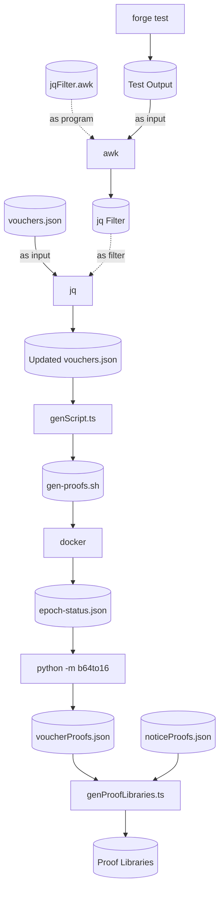

# Updating Proofs

## Dependencies

* GNU sed, awk & grep
* Docker
* Python 3.8 or newer
* jq

## Setup

1. Clone the `machine-emulator` repository anywhere you want. In this example, we'll clone it in `~/Cartesi/`.

```sh
cd ~/Cartesi/
git clone https://github.com/cartesi-corp/machine-emulator.git
```

2. Check out to the `feature/gen-proofs` branch

```sh
cd machine-emulator
git checkout feature/gen-proofs
```

3. Build the `gen-proofs` Docker image

```sh
docker build -t cartesi/server-manager-gen-proofs:devel .
```

4. Install the following Python package

```sh
pip3 install base64-to-hex-converter
```

## Procedure

Now, everytime you think the proofs might need to be updated, just run the following command.
Feel free to change the path to the `machine-emulator` repository in the command if you haven't cloned it in `~/Cartesi/`.
If `MACHINE_EMULATOR_REPO` isn't set, it will assume the `machine-emulator` repository is sitting right next to the `rollups` repository.
In other words, it will assume they have the same parent directory.

```sh
MACHINE_EMULATOR_REPO=~/Cartesi/machine-emulator
./update-proofs.sh
```

If you're curious as to how the `update-proofs.sh` script works, here's a diagram of the pipeline.


