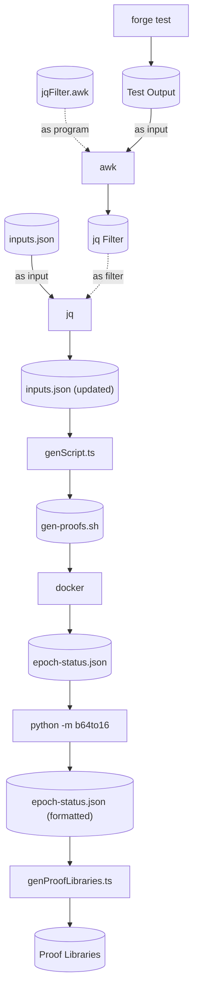

# Updating Proofs

When someone tries to execute a voucher or to validate a notice, they need to provide a proof. This proof is checked on-chain by the DApp contract. In order to test the proof verification scheme, we need to generate proofs and check them with Forge. The scripts in this folder help automate the process of updating the proofs.

## Dependencies

-   yarn
-   GNU awk
-   Docker
-   Python 3.8 or newer
-   jq

## Setup

Once you've installed all dependencies listed above, there is still some setup left to do.

**Warning:** We use `python3` and `pip3` to interact with Python. If you do not wish to dirty your global Python installation, we recommend you to create a local virtual environment (with `venv` or `pyenv`), and activate it beforehand.

### Automatic Setup

```sh
./update-proofs.sh --setup
```

### Manual Setup

1. Build the `gen-proofs` Docker image

```sh
docker build -t cartesi/server-manager-gen-proofs:devel .
```

2. Install the necessary Python packages

```sh
pip3 install -r requirements.txt
```

## Procedure

Now, everytime you suspect the proofs might need to be updated, you can simply run the following command.

```sh
./update-proofs.sh
```

## Pipeline

If you're curious to know how the `update-proofs.sh` script works, here's a diagram of the pipeline.


