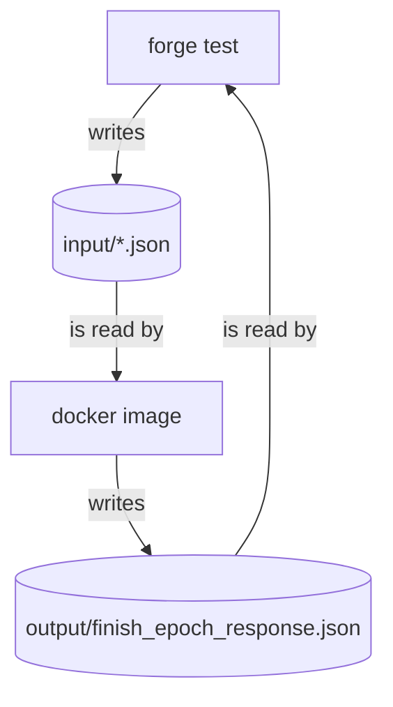

# Updating Proofs

When someone tries to execute a voucher or to validate a notice, they need to provide a proof. This proof is checked on-chain by the DApp contract. In order to test the proof verification scheme, we need to generate proofs and check them with Forge. The scripts in this folder help automate the process of updating the proofs.

## Dependencies

-   docker
-   forge
-   yarn

## Setup

Once you've installed all dependencies listed above, there is still some setup left to do.

```sh
yarn proofs:setup
```

## Procedure

Now, everytime you suspect the proofs might need to be updated, you can simply run the following command.

```sh
yarn proofs:update
```

## Pipeline

If you're curious to know how the `update-proofs.sh` script works, here's a diagram of the pipeline.


